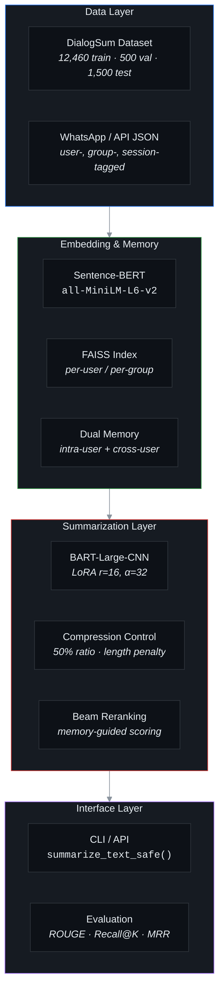
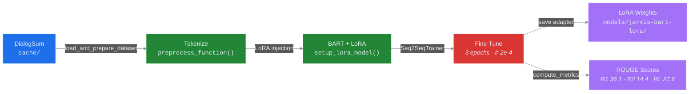
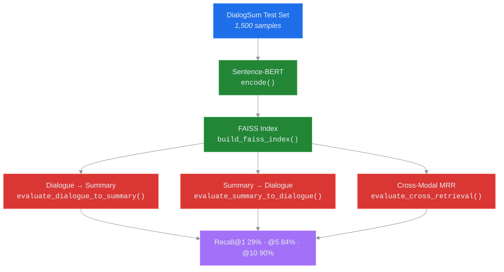

# JARVIS-M — System Architecture

> Mermaid diagrams below render natively on GitHub. All colours use a dark-mode palette.

---

## High-Level Overview

---

## Training Pipeline

> **Entry point:** [`scripts/train_summarizer.py`](../scripts/train_summarizer.py)

### Key functions

| Function | File | Purpose |
|----------|------|---------|
| `setup_device()` | [`train_summarizer.py`](../scripts/train_summarizer.py) | GPU / CPU detection with sm_120 fallback |
| `load_and_prepare_dataset()` | [`train_summarizer.py`](../scripts/train_summarizer.py) | DialogSum loading & preprocessing |
| `setup_lora_model()` | [`train_summarizer.py`](../scripts/train_summarizer.py) | LoRA config (r=16, α=32, q/k/v/out_proj) |
| `compute_metrics()` | [`train_summarizer.py`](../scripts/train_summarizer.py) | ROUGE-1/2/L evaluation |

---

## Retrieval Evaluation Pipeline

> **Entry point:** [`scripts/eval_retrieval.py`](../scripts/eval_retrieval.py)  
> **Metrics explained:** [`docs/RETRIEVAL_EVALUATION.md`](RETRIEVAL_EVALUATION.md)

---

## Ablation Study — Dual-Memory Reranking

> **Entry point:** [`scripts/ablation_study.py`](../scripts/ablation_study.py)

### Ablation Configurations

| Config | Intra-User | Cross-User | Description |
|--------|:----------:|:----------:|-------------|
| `no_memory` | ✗ | ✗ | Baseline — beam search only |
| `intra_only` | ✓ | ✗ | Single-user session memory |
| `cross_only` | ✗ | ✓ | Cross-user collaborative memory |
| `full` | ✓ | ✓ | Full dual-memory pipeline |

---
